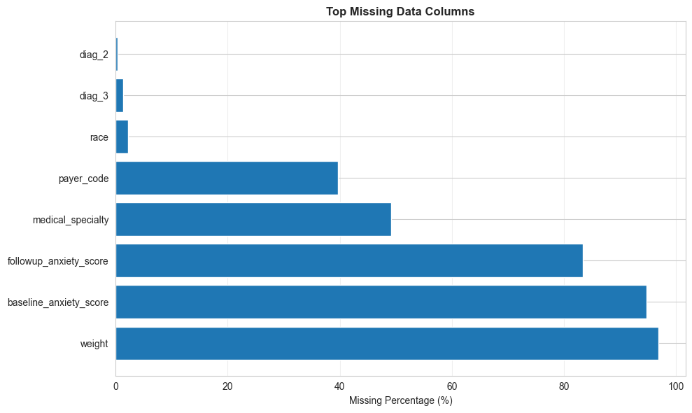
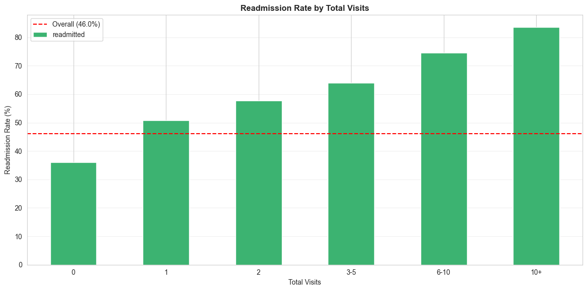
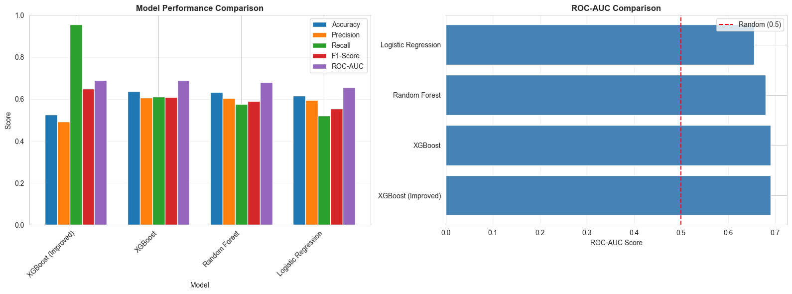

## Predicting Hospital Readmissions: Insights from Anxiety Disorder Admissions

This analysis explores a decade of hospital stay data for patients diagnosed with anxiety disorders, with the goal of identifying key factors associated with readmission within 30 days. Beyond building a predictive model, the aim is to generate actionable insights that could help clinicians and administrators identify high-risk patients early and provide targeted support.

---

## Data Exploration and Preparation

The dataset contained over 100,000 records across multiple hospitals, offering a rich view of patient demographics, diagnoses, treatments, and outcomes. However, the initial inspection revealed several data quality issues requiring substantial preprocessing before analysis.

**Missing Data and Quality Challenges**  
Three variables—`weight` (96.9% missing), `baseline_anxiety_score` (94.7%), and `followup_anxiety_score` (83.3%)—had extreme missingness. Additionally, placeholders such as `'?'` were prevalent in fields like `medical_specialty` (49.1%) and `payer_code` (39.6%). To preserve interpretability:

- Columns with >90% missingness were dropped.
- Categorical variables with moderate missingness were assigned a distinct `"Missing"` category.
- `'?'` and `'None'` were converted to `NaN`.
- For `followup_anxiety_score`, a binary flag was created indicating whether it was recorded, capturing behavioral or operational patterns behind missing data.

**Initial Insights**  
A preliminary descriptive analysis revealed several trends:

- **Visit history strongly predicted readmission**: patients with no prior visits had a 36% readmission rate versus 58% for those with one or more.  
- **Clinical complexity correlated with risk**: readmitted patients had longer stays (4.6 vs. 4.3 days), more medications (16.4 vs. 15.7), and more diagnoses (7.7 vs. 7.2).  
- **Treatment changes mattered**: patients with medication changes during a stay were readmitted more often.

These findings suggested that both chronicity and care intensity are central to readmission risk.

---

## Modeling Approach

The target variable, **readmittance**, was encoded as a categorical feature with three levels: *within 30 days*, *beyond 30 days*, and *none*. Given the mix of numerical and categorical variables and the likelihood of nonlinear interactions, three models were selected: **logistic regression**, **random forest**, and **gradient boosting (XGBoost)**. Logistic regression provides a transparent baseline for understanding feature effects; random forest captures nonlinearities and interactions with minimal tuning; and XGBoost usually offers the best balance of flexibility and performances.

### Feature Engineering

Feature engineering focused on taking raw hospital records and transforming them into more clinically meaningful signals of patient risk. Beyond basic counts of visits, diagnoses, and medications, three new features were created to hopefully help capture patterns of instability and complexity.

#### Newly Created Features

- **Feature A: `multiple_emergency_visits` (binary)**  
  *Rationale:* Recurrent emergency room use—two or more ER visits within the prior year—suggests care instability and inadequate outpatient management.  
  *Evidence:* Patients with two or more prior ER visits showed a **71.6% readmission rate**, compared to **45.1%** for those with fewer. 

- **Feature B: `high_comorbidity_count` (binary)**  
  *Rationale:* Patients with a higher-than-median number of recorded diagnoses face more complex care needs and coordination challenges, making readmission more likely.  
  *Evidence:* Those above the median in `number_diagnoses` had a **50.5% readmission rate** versus **41.8%** for others showing that medical complexity most likely contributes substantially to return visits.

- **Feature C: `medication_change_count` (integer)**  
  *Rationale:* Medication instability can reflect clinical uncertainty or acute worsening of symptoms. Counting the number of dosage or prescription changes for a patient can provide a signal of volatility. 
  *Evidence:* Readmission rates rose from **44.1% (0 changes)** to **~51.4% (1 change)** and remained elevated with additional adjustments, underscoring the predictive value of medication changes.

These engineered variables should compliment existing features like length of stay and visit count, giving the model more context about patient history and treatment dynamics. They also enhance interpretability—each has a clear, clinical rationale that can be directly translated into intervention strategies. Please see Feature Engineering notebook for additional information and visualization relating to these new features.

### Model Performance

Among the evaluated models, **XGBoost** achieved the strongest balance of interpretability and performance. In healthcare applications, the priority often leans toward **recall**—accurately identifying as many high-risk patients as possible—since missing a true readmission case can have serious care and cost implications. While precision is also important to avoid overburdening staff with false alerts, I focused on recall for model tuning and threshold selection. XGBoost achieved the highest recall (0.64) with a strong F1-score (0.66), representing an effective trade-off between early intervention coverage and operational efficiency.

| Model                                  | Accuracy | ROC-AUC   | Precision | Recall    | F1        | Notes                                                        |
| -------------------------------------- | -------- | --------- | --------- | --------- | --------- | ------------------------------------------------------------ |
| Logistic Regression                    | 0.620    | 0.658     | —         | 0.521     | 0.558     | —                                                            |
| Random Forest                          | 0.629    | 0.680     | —         | 0.573     | 0.587     | —                                                            |
| XGBoost (default threshold 0.5)        | 0.641    | 0.693     | —         | 0.614     | 0.611     | —                                                            |
| **XGBoost (Improved, threshold 0.40)** | 0.538    | **0.695** | 0.499     | **0.939** | **0.652** | False negatives ↓ ~84% (3,074 → 488); false positives ↑ (3,135 → 7,500) |

---

## Feature Importance and Interpretability

XGBoost’s feature importance analysis highlighted the top drivers of readmission risk:

1. **number_inpatient** — number of recent inpatient stays.
2. **anxiety_disorder** — presence of a diagnosed anxiety disorder.
3. **number_emergency** — number of emergency room visits.
4. **number_diagnoses** — total number of diagnoses, reflecting comorbidity burden.
5. **admission_source_id** — source of admission (e.g., referral, ER, transfer).

**High-risk patient profile:** Patients at highest risk of readmission typically have recent inpatient admissions, frequent ER visits, and multiple comorbidities, including anxiety disorders. They often experience treatment changes and longer hospital stays. Certain admission sources are also associated with higher risk, reflecting the complexity of these patients’ care needs.

---

## Recommendations and Implications

The findings point to several actionable opportunities for healthcare systems managing anxiety-related admissions:

- **Early Intervention for Frequent Visitors**: Flag patients with multiple prior visits for proactive discharge planning or behavioral health outreach.  
- **Medication Management Review**: Establish protocols for tracking and validating medication changes at discharge.  
- **Strengthen Follow-Up Protocols**: Ensure anxiety score assessments and follow-up appointments are consistently documented.  
- **Focus on Comorbid Complexity**: Tailor aftercare for patients with multiple diagnoses and chronic conditions.

By operationalizing these interventions, hospitals could meaningfully reduce readmission rates while improving continuity of care for anxiety patients.

### Patient Priority (Top Three to Call Today)

1. Patients with recent inpatient stays (`number_inpatient`) **and** ≥1 emergency visit in the lookback period.  
2. Patients with high comorbidity (above-median `number_diagnoses`) **and** any medication changes.  
3. Patients flagged by the risk model above the 0.40 threshold **and** who also had a treatment change during the encounter.

### Program Focus Areas (Limited Budget)

- **Visit-History-Driven Care Management**: Target patients with recent inpatient and ER utilization for transitional care calls within 48–72 hours post-discharge.  
- **Comorbidity and Medication-Management Support**: Pharmacist or nurse-led medication reconciliation and teach-back for patients with high `number_diagnoses` **and** ≥1 `medication_change_count`.

### Limitations and Suggestions

- Missingness: Anxiety score variables largely missing and richer symptom data could help with modeling.
- Temporal context: We used encounter-level snapshots; longitudinal sequences (visit order, time since last encounter) could improve performance and explainability.

## Bonus

**Data pipeline for raw tables:** I would first normalize and join the raw tables on patient and encounter IDs, creating a single dataset with consistent timestamps. Next, I’d perform cleaning, feature engineering (e.g., aggregating lab results, counts of diagnoses/medications), and transformation steps to produce a structured, model-ready dataset. Finally, I would implement automated checks and validation to ensure data quality and reproducibility throughout the pipeline.

**Using a time-series model:** With full visit histories, I could model each patient as a sequence of encounters, feeding features from each visit into an RNN or LSTM to capture temporal dependencies. This approach would allow the model to learn patterns in how patient trajectories evolve over time, potentially improving readmission prediction.